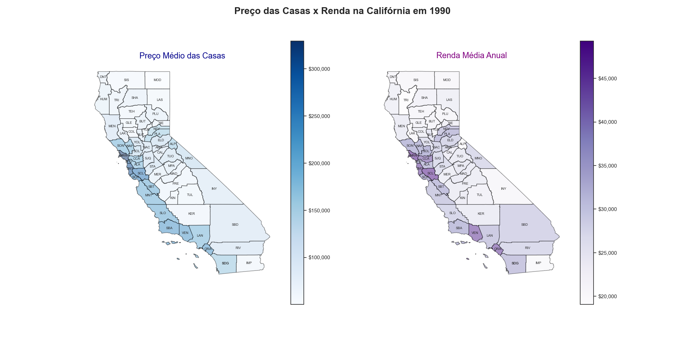
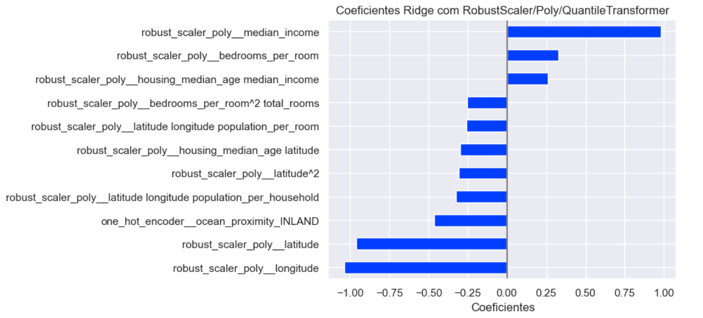
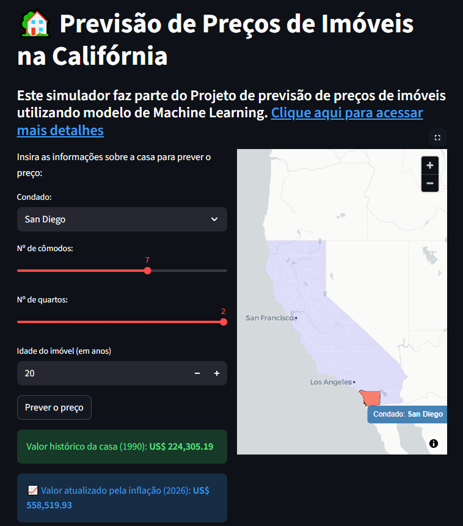

# 🏡 Previsão de Preços de Imóveis na Califórnia (California Housing)


Acesse o aplicativo interativo rodando em nuvem aqui: **👉  https://california-housing-1990.streamlit.app/ 👈** 

## 📖 Contextualização
O mercado imobiliário é impulsionado por uma complexa rede de fatores, desde as características físicas do imóvel até a sua localização geográfica e o perfil socioeconômico da vizinhança. Este projeto utiliza os dados do censo da Califórnia (1990) para explorar e entender a fundo essas dinâmicas.

A base de dados não avalia casas individuais, mas sim quarteirões/distritos, fornecendo uma visão macroeconômica fascinante sobre como a distribuição de renda, a densidade populacional e a proximidade com o oceano moldam o custo de vida no estado.





## 🎯 Objetivos do Projeto
1. **Desenvolver um Modelo Preditivo:** Criar e otimizar um modelo de Machine Learning capaz de prever com precisão o valor mediano das casas (`median_house_value`) em diferentes distritos da Califórnia.
2. **Análise de Importância de Variáveis (Feature Importance):** Identificar e quantificar quais características têm o maior impacto (positivo ou negativo) no preço final do imóvel, extraindo insights de negócios acionáveis.
3. **Análise Geoespacial:** Mapear a distribuição de preços e cruzar os dados com limites administrativos (condados) para entender a correlação espacial utilizando mapas interativos e estáticos.
4. **Deploy Interativo:** Disponibilizar o modelo através de uma interface web para simulações em tempo real.

## 🛠️ Tecnologias e Bibliotecas Utilizadas
* **Manipulação de Dados:** `pandas`, `numpy`
* **Análise Geoespacial:** `geopandas`, `folium`, `contextily`, `pydeck`
* **Visualização:** `matplotlib`, `seaborn`
* **Machine Learning:** `scikit-learn` (Pipelines, ColumnTransformer, GridSearchCV, Modelos de Regressão)
* **Deploy e Web App:** `streamlit`

## 🔍 Destaques da Análise (Feature Engineering)
Durante o desenvolvimento, variáveis brutas foram transformadas em métricas mais representativas da realidade imobiliária:
* **Proporções de Cômodos:** Criação de variáveis como `bedrooms_per_room` e `rooms_per_household` para medir o padrão do imóvel (casas de luxo vs. apartamentos compactos).
* **Densidade Habitacional:** Análise da `population_per_household` para identificar áreas de superlotação vs. bairros residenciais amplos.
* **Distância de Centros Administrativos:** Cálculo de distância espacial (em metros/km) entre os imóveis e os centroides dos condados da Califórnia.

## 🏆 Resultados e Conclusões

Após testar múltiplos algoritmos, o modelo vencedor foi uma **Regressão Ridge Polinomial (com Transformação de Target)**, alcançando um erro médio de **US$ 38.601,46**. 

A escolha dessa arquitetura específica se provou a mais eficiente devido a três fatores técnicos aplicados no pipeline de pré-processamento:
1. **RobustScaler:** Protegeu o modelo contra a forte presença de *outliers* nos dados do censo.
2. **Expansão Polinomial:** Permitiu que o modelo linear capturasse a complexidade e as relações não lineares do mercado imobiliário.
3. **Quantile Transformer & Ridge:** A transformação do alvo (`Target`) aliada à penalização L2 (Ridge) estabilizou a variância das previsões e evitou o *overfitting*, garantindo que o modelo generalize bem para novos dados.

Além da precisão técnica, a análise exploratória e a extração de Feature Importance revelaram insights valiosos para o mercado imobiliário:

* **A Renda dita a Regra:** A renda média (`median_income`) da vizinhança provou ser o fator isolado que mais impacta o valor final do imóvel.
* **O Efeito Litoral:** Imóveis classificados com proximidade ao oceano possuem um prêmio no preço consideravelmente maior do que imóveis no interior.

<div align="center">



</div>

Desenvolvido por Gabriel Duarte https://www.linkedin.com/in/djgabriel93/


## 🚀 Como Executar Localmente

Caso queira clonar o repositório e testar as análises ou o simulador na sua máquina:

1. Clone o repositório:
```bash
git clone https://github.com/djgabriel93/California_housing_prices.git
cd California_housing_prices
```

2. Crie e ative o ambiente virtual via Conda:
```bash
# Criar o ambiente
python -m venv venv

# Ativar no Windows:
venv\Scripts\activate

# Ativar no Linux/Mac:
source venv/bin/activate
```

3. Instale as dependências:
```bash
pip install -r requirements.txt
``` 

4. Para rodar a aplicação web localmente:
```bash
streamlit run home.py
```


## 📂 Organização do projeto

```
├── .gitignore         <- Arquivos e diretórios a serem ignorados pelo Git
├── requirements.yml    <- O arquivo de requisitos para reproduzir o ambiente de análise
├── LICENSE            <- Licença de código aberto se uma for escolhida
├── README.md          <- README principal para desenvolvedores que usam este projeto.
|
├── dados              <- Arquivos de dados para o projeto.
|
├── modelos            <- Modelos treinados e serializados, previsões de modelos ou resumos de modelos
|
├── notebooks          <- Cadernos Jupyter. A convenção de nomenclatura é um número (para ordenação),
│                         as iniciais do criador e uma descrição curta separada por `-`.
│
|   └──src             <- Código-fonte para uso neste projeto.
|      │
|      ├── __init__.py    <- Torna um módulo Python
|      ├── config.py      <- Configurações básicas do projeto
|      ├── graficos.py    <- Scripts para criar visualizações exploratórias e orientadas a resultados
|      ├── models.py      <- Scripts para serem utilizadas na criação e treinamento de modelos e pipelines de machine learning
|      └── auxiliares.py  <- Scripts auxiliares

|
├── referencias        <- Dicionários de dados, manuais e todos os outros materiais explicativos.
|
├── relatorios         <- Análises geradas em HTML, PDF, LaTeX, etc.
│   └── imagens        <- Gráficos e figuras gerados para serem usados em relatórios
```
